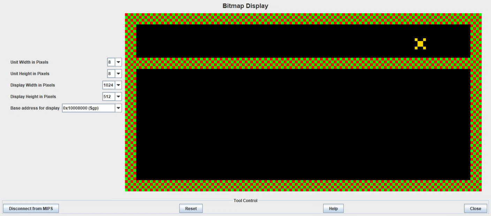
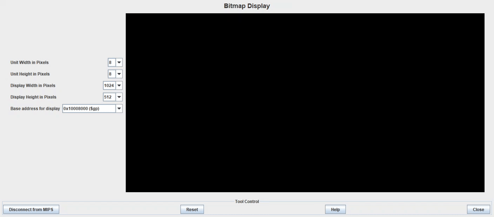

# Assembly Dash

## About
- MIPS assembly platformer game course project for Computer Organization
- All stages of the project built from the ground up.
- Result: Achieved 112.5% project grade and inducted to the "Notable Projects" list by the Teaching Team
- Author: Vincent Zhang
- Since: 2024-03-23 to 2024-04-03 (6 days for full-feature version, 10 days for extra game polish and code optimization)
- Lines: 598 (with documentation)
- Lines: 477 (without documentation, typically at least 1000+ lines with some even reaching 20,000 lines)
- Tech: MIPS assembly, Python, pillow

## Demo

- Code: https://github.com/vincentzhang15/assembly-dash
- Demo: https://youtu.be/hmnjrcO5Fuc

## Key Features
- Clean and concise code with documentation.
- Large bitmap display with multiple levels.
- Aesthetic graphics with gradient background.

## Code Strategy
- Each displayed object is an 8x8 pixel unit, balancing resolution with performance.
- Each level object is an ASCII symbol that maps to 1. an integer representation and 2. an 8x8 hex colour grid.
    - ^: 2 (spike), (hex grid omitted)
    - F: 3 (goal)
    - 1: 1 (platform, used as 1x1 ice block)
    - C: 1 (platform, used as the bird - i.e., the bird is a platform)
    - _: 0 (sky/sea)
    - etc. see `LevelGenerator.py`
- Use integer array for collision detection, e.g., if any of the four corners of the player is colliding with object type 1, then colliding with platform. If type 2, then colliding with spike, end game. Etc.
- Use hex array for display.
    - Static 8x8 objects are painted into the level (i.e., part of the background).
    - Dynamic 8x8 objects have their hex grid exported as an assembly array to display dynamically.
    - 0xFFFFFFFF is reserved as a transparent color to display dynamic objects with transparency relative to the gradient background.
- Dynamic object (aka. agent) update strategy:
    1. Check new position for agent-level and agent-agent collision. If all clear proceed.
    2. Breakdown multi-pixel movement into a loop with at most one pixel per update for smooth jump/drop/move animation.
    3. Restore 8x8 section of background at current agent position.
    4. Draw agent in new position.
- H-Agent (horizontal agent) is a generalization/abstraction of the alien and bubble that allows the collision and movement of the two different types of agents to be combined as one.
- Gravity/Jump: implemented as a decay/growth in vertical distance applied gradually via an array.
- Store previous horizontal movement status to polish diagonal jump.
- Ice blocks are generated by compressing ice block image to 8x8 with the Pillow Lanczos filter.

## Log
### Day 1-6: Full-Feature Version
- 2024-03-23 (Day 1): Level generated, player can move. Code optimization for show/restore map --> display map.

- 2024-03-24 (Day 2): Screen boundary collision detection. Platform collision. Jump and gravity.

- 2024-03-25 (Day 3): Improve graphics: gradient background, better game-element colours. Fix jump. Allow only double jump.

- 2024-03-26 (Day 4): Increase graphics resolution by 4 times from 128x64 to 256x128 pixels. Add LR-Agent (left-right agent), animate agent, and add LR-agent-level collision. Add start menu, win/lose screens. Generalize player-level collision and LR-Agent-level collision to agent-level collision. Add quit restart keys and transition logic. Add game over/win flow.

- 2024-03-27 (Day 5): Agent-agent collision complete. Add projectile and projectile-block. Add level 1 score.

- 2024-03-28 (Day 6): Completed all 3 levels. In-game score and game over/win score done. Revamp graphics. Update starting position in each level. Code clean-up and commenting. **Game completed**. Record demo and submit as backup version.

### Day 7-10: Extra Game Polish and Code Optimization
- 2024-03-31 (Day 7): Early stages of gravity refinement. Code clean-up. Change frame update regulator from counter-based to sleep-based. 805 lines.
- 2024-04-01 (Day 8): Fix jumping and gravity. Revamp start menu. New map skin. Documentation, cleanup, optimizations. 940 lines.

- 2024-04-02 (Day 9): Documentation, cleanup, optimizations. 724 lines.
- 2024-04-03 (Day 10): Condense and optimizations. 598 lines with documentation 477 without. Record demo of revamped version (improved jumping, gravity, graphics).
